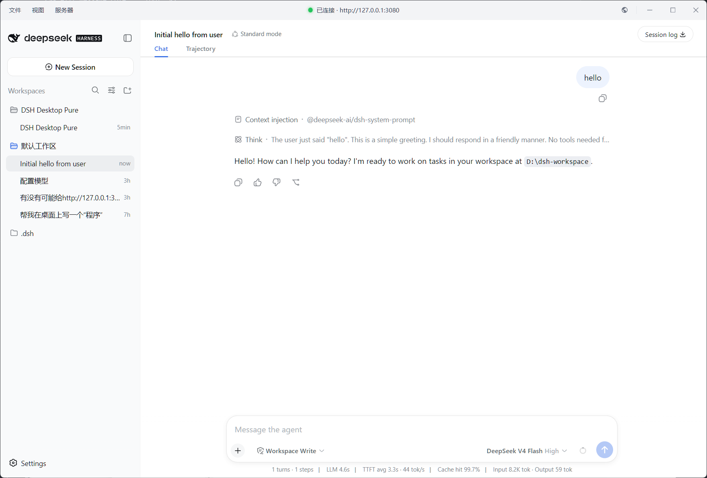

# DSH Desktop Pure

> A **zero-intrusion, pure-WebUI desktop shell** for DeepSeek Harness (`dsh web`): an Electron window that hosts the local Harness web app as a native desktop experience — **without modifying any DSH source code, resource, or configuration**.

[](./LICENSE)
[](https://www.electronjs.org)
[](#platform-support)

**Language**：🇨🇳 [中文](./README.md)（default） · 🇬🇧 [English](./README.en.md)

<p align="center">
  
</p>

## 📌 Fully independent from DSH (important)

**DSH Desktop Pure and DSH are completely independent projects that can be updated separately:**

- ✅ You can **update DSH alone without updating DSH Desktop Pure** — just run `npm update -g @deepseek-ai/dsh` and restart this app;
- ✅ Unless DSH ships a **massive breaking change**, an **older version of DSH Desktop Pure will almost never stop working**;
- ✅ This app performs only a **small amount of read-only probing** of DSH (page structural markers in the HTTP response, the URL line in the spawned process's stdout). If a DSH update breaks any of these reads, **only a console warning is printed — the desktop app keeps working normally**.

## Design principles

| Principle | Meaning |
| --- | --- |
| **Zero intrusion into DSH** | The shell contains **no DSH code, frontend assets, or configuration**; it never patches, hooks, or modifies anything in DSH's installation |
| **Read-only** | Every interaction with DSH is read-only: HTTP port probing, reading the stdout of a process *it* spawned, spawning/killing *its own* `dsh web` child |
| **Pure WebUI shell** | The UI is **100%** served by `dsh web`; the shell only draws **its own** title bar / dropdown menus / loading page / tray (a few shell-owned static HTML files) and never injects into or modifies the Harness DOM |
| **No source modification** | The Harness page, the `window.__DSH_BOOT__` injection, and the `/api/*` RPC all come verbatim from the `dsh web` process; the shell just loads it and wraps it in desktop chrome |

## Features

- **Port policy (single port, never silently drifts)**: reuse first (a Harness already on the port → reused, marked "reused"); free port → auto-spawn `dsh web`; held by another process → dialog with **process name + PID**, "Retry / Close".
- **Self-drawn one-row title bar**: status dot (🟢 connected / 🟡 starting / 🔴 disconnected) + `File / View / Server` menus (pinned directly under the button, hover-switch while open) + "open in browser" + window controls (drawn on Win/Linux, native traffic lights on macOS); window title pinned to *DSH Desktop Pure*.
- **System tray**: `✕` or "File → Minimize to tray" hides the window while **the dsh server keeps running in the background**; tray right-click: Show window / Restart dsh server / Quit.
- **Restart dsh server**: one-click restart (works for self-spawned and reused instances) with a theme-aware loading page; the app **never quits** on restart; failures show a non-blocking warning and are retryable.
- **Theme**: light / dark / follow system (`nativeTheme`, persisted to `userData/theme.json`); shell UI re-skins automatically.
- **Hardened security**: renderer `sandbox` + `contextIsolation` + no `nodeIntegration`; only loopback navigation/popups; remote links go to the OS browser; all `<webview>` disabled.
- **Version-drift safe**: every read of DSH has a degradation path — a warning / conservative branch, **never a crash**.
- **Single instance**: re-launching focuses the existing window.

## Platform support

| Platform | Test status | Installer |
| --- | --- | --- |
| **Windows** | ✅ Fully tested | ✅ Released |
| **macOS** | ⚠️ Not tested yet | ⚠️ Coming soon |
| **Linux** | ⚠️ Not tested yet | ⚠️ Coming soon |

> Code-level platform branching is complete (process management, port discovery, window chrome, shortcuts, theme, tray); macOS / Linux users can build it themselves — test feedback and PRs are welcome.

## Roadmap

1. **Auto-download native DSH** — on first run, if `@deepseek-ai/dsh` is missing, fetch and install it automatically (no manual global install).
2. **Custom port** — `--port` / `DSH_ELECTRON_PORT` already work; planned: a friendlier in-UI configuration with persistence.
3. **Connect to a remote DSH Web** — point at a non-loopback `dsh web` instance (requires a security-model review; currently loopback only).
4. **Companion DSH plugin (desktop enhancement)** — a DSH plugin that enhances the desktop experience. **Positioning is explicit**: development focus **always stays on the desktop app itself**, and will **not** shift to "plugin ↔ desktop linkage"; the plugin is an **optional enhancement** — **without it, the vast majority of the normal experience is preserved**, and the desktop app never depends on the plugin.

## Install & run

1. **Install DSH** (skip if already installed):

   ```bash
   npm install -g @deepseek-ai/dsh
   ```

2. **Windows users**: download the Windows installer from [Releases](https://github.com/WJBFks/dsh-electron/releases), install it, and double-click to run.

> For building on other platforms, running from source, and command-line configuration, see the [detailed reference](./docs/DETAILS.en.md).

## More documentation

- 📖 **[Detailed reference](./docs/DETAILS.en.md)** — behavior / running from source / upgrading DSH / security / directory layout / packaging, for power users and contributors.

## License

[MIT](./LICENSE) © 2026 WJBFks
