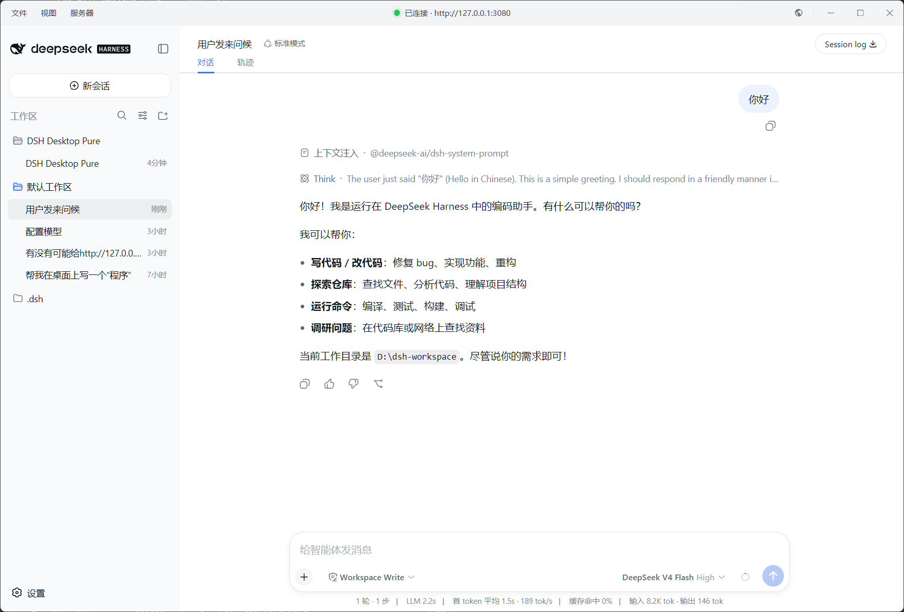

# DSH Desktop Pure

> DeepSeek Harness（`dsh web`）的**零侵入纯 WebUI 桌面套壳**：用 Electron 把本地 Harness 网页应用装进原生桌面窗口，**不修改 DSH 源程序的任何代码、资源与配置**。

[](./LICENSE)
[](https://www.electronjs.org)
[](#跨平台)

**语言 / Language**：🇨🇳 [中文](./README.md)（默认） · 🇬🇧 [English](./README.en.md)

<p align="center">
  
</p>

## 📌 与 DSH 完全独立（重要声明）

**DSH Desktop Pure 与 DSH 是完全独立的项目，二者可以分开更新：**

- ✅ 你可以**只更新 DSH 而不更新 DSH Desktop Pure**（`npm update -g @deepseek-ai/dsh` 后重启本应用即可）；
- ✅ 除非 DSH 发布**巨大的破坏性更新**，否则**老旧版本的 DSH Desktop Pure 几乎不会失效**；
- ✅ 本应用对 DSH 仅有**少量只读探测**（端口响应中的页面结构标记、子进程 stdout 的 URL 行）；若因 DSH 更新导致这些读取失败，**仅会在控制台打印警告，完全不影响桌面端的正常运行**。

## 设计原则

| 原则 | 含义 |
| --- | --- |
| **零侵入 DSH 本体** | 壳里**不包含任何 DSH 代码、前端资源或配置**；不 patch、不 hook、不改动 DSH 安装目录里的任何文件 |
| **仅读取** | 对 DSH 的一切交互都是只读的：HTTP 探测端口、读取自己拉起的子进程 stdout、spawn / kill 自己拉起的 `dsh web` 进程 |
| **纯 WebUI 套壳** | 界面 **100%** 由 `dsh web` 提供；壳只绘制**自己的**标题栏 / 下拉菜单 / 加载页 / 托盘（几个壳自有的静态 HTML），从不注入或修改 Harness 的 DOM |
| **不修改源程序** | Harness 页面、`window.__DSH_BOOT__` 注入、`/api/*` RPC 全部原样来自 `dsh web` 进程，壳只负责把它加载进来并加桌面化外壳 |

## 功能

- **端口策略（单端口，绝不静默漂移）**：复用优先（端口已有 Harness → 直接复用，状态标注「已复用」）；端口空闲 → 自动拉起 `dsh web`；被其他进程占用 → 弹窗给出**进程名 + PID**，「重试 / 关闭」。
- **自绘单行标题栏**：状态点（🟢 已连接 / 🟡 启动中 / 🔴 已断开）+ `文件 / 视图 / 服务器` 菜单（固定在按钮正下方弹出、打开时 hover 即切换）+「在浏览器中打开」+ 窗口控制（Win/Linux 自绘，macOS 原生交通灯）；窗口标题固定为 *DSH Desktop Pure*。
- **系统托盘**：点 `✕` 或「文件 → 最小化到托盘」隐藏到托盘，**dsh 服务器后台继续运行**；托盘右键：打开窗口 / 重启 dsh 服务器 / 退出。
- **重启 dsh 服务器**：一键重启（兼容自建 / 复用实例），期间显示主题感知加载页，**不退出应用**；失败仅弹非阻塞警告，可重试。
- **主题**：浅色 / 深色 / 跟随系统（`nativeTheme`，持久化到 `userData/theme.json`），壳 UI 自动换肤。
- **安全加固**：渲染进程 `sandbox` + `contextIsolation` + 无 `nodeIntegration`；仅允许 loopback 导航 / 弹窗；外链交系统浏览器；禁用 `<webview>`。
- **版本漂移安全**：对 DSH 的每一处读取都有降级路径——失效时警告 / 保守处理，**绝不崩溃**。
- **单实例**：重复启动把已有窗口提到前台。

## 跨平台

| 平台 | 测试状态 | 安装包 |
| --- | --- | --- |
| **Windows** | ✅ 已完整测试 | ✅ 已发布 |
| **macOS** | ⚠️ 暂未测试 | ⚠️ 即将发布 |
| **Linux** | ⚠️ 暂未测试 | ⚠️ 即将发布 |

> 代码层已完成全平台分支（进程管理、端口识别、窗口样式、快捷键、主题、托盘）；macOS / Linux 可自行构建体验，欢迎测试反馈与 PR。

## 后续计划（Roadmap）

1. **自动下载原生 DSH** —— 首次运行若检测到未安装 `@deepseek-ai/dsh`，自动拉取安装，免去手动全局安装。
2. **自定义端口** —— 已支持 `--port` / `DSH_ELECTRON_PORT`；计划增强为界面化配置 + 持久化。
3. **可连接远程 DSH Web** —— 支持指向非 loopback 的远程 `dsh web` 实例（需重新评估安全模型，当前仅允许 loopback）。
4. **配套 DSH 插件（增强桌面端体验）** —— 以 DSH 插件形式提供增强能力。**定位明确**：开发重心**始终在桌面端本体**，不会转移到「插件 ↔ 桌面端联动」；插件是**可选增强**，**不安装插件也保留绝大部分正常体验**，桌面端绝不依赖插件即可完整使用。

## 安装与运行

1. **安装 DSH**（已安装可跳过）：

   ```bash
   npm install -g @deepseek-ai/dsh
   ```

2. **Windows 用户**：到 [Releases](https://github.com/WJBFks/dsh-electron/releases) 下载 Windows 安装包，安装后双击运行即可。

> 其他平台的构建方式、从源码运行、命令行配置等，详见 [详细说明](./docs/DETAILS.md)。

## 更多文档

- 📖 **[详细说明](./docs/DETAILS.md)** —— 行为说明 / 从源码运行 / 升级 DSH / 安全说明 / 目录结构 / 打包发布，面向进阶用户与贡献者。

## License

[MIT](./LICENSE) © 2026 WJBFks
